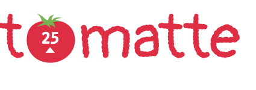

 <div align="center" id="top"> 
  <a href="https://github.com/Adriano-Santtos/Tomatte"> Inglês </a>
  - <a> Português </a>
</div>
&#xa0;

<div align="center" id="top"> 
  
 
</div> 

  <!-- <a href="https://amehackathonfcamara.netlify.app">Demo</a> -->
</div>

<h1 align="center">Tomatte</h1>

<p align="center">
  

  

  

  

  <!--  -->

  <!--  -->

  <!--  -->
</p>

Status

<h4 align="center"> 
	🚧  O Tomatte 🚀 está em construção...  🚧
</h4> 

<hr>

<p align="center">
  <a href="#dart-sobre">Sobre</a> &#xa0; | &#xa0; 
  <a href="#sparkles-funcionalidades">Funcionalidades</a> &#xa0; | &#xa0;
  <a href="#rocket-tecnologias">Tecnologias</a> &#xa0; | &#xa0;
  <a href="#white_check_mark-requisitos">Requisitos</a> &#xa0; | &#xa0;
  <a href="#checkered_flag-clone">Clone</a> &#xa0; | &#xa0;
  <a href="#memo-license">Licença</a> &#xa0;  &#xa0;
</p>

&#xa0

<br>

## :dart: Sobre ##

O **Tomatte** foi inspirado no [Move.it](https://www.figma.com/file/5d1esZL1c8jwUFlPrcOtjQ/Move.it-1.0-(Copy)?node-id=160%3A2761), projeto realizado durante a 4ª edição da Next Level Week, realizado pela [Rocketseat](https://rocketseat.com.br/).

Essa aplicação combina a técnica pomodoro com a realização de alongamentos durante as pausas.


## :sparkles: Funcionalidades ##

Cadastro de escolas participantes;\
👉 Cadastro de alunos carentes;\
👉 Cadastro de doadores ou doação anônima;\
👉 Pesquisa de escolas participantes;\
👉 Notificação de disponibilidade de materiais recebidos;\

## :rocket: Tecnologias ##

As seguintes ferramentas foram usadas nesse projeto:

- [Node.js](https://nodejs.org/en/)
- [ReactJS](https://pt-br.reactjs.org/)
- [Next.js](https://nextjs.org/)
- [TypeScript](https://www.typescriptlang.org)
- [NextAuth.js](https://next-auth.js.org/)
- [Vercel](https://vercel.com/)

## :white_check_mark: Requisitos ##

Antes de começar :checkered_flag:, você precisa ter o  [Git](https://git-scm.com) e o [Node](https://nodejs.org/en/) instalados em sua máquina.

## :checkered_flag: Clone ##

```bash
# Clone esse repositório
$ git clone https://github.com/Adriano-Santtos/tomatte

# Vá até a pasta do projeto
$ cd tomatte

# Instale as dependências
$ yarn

# Execute o projeto
$ yarn start

# O servidor vai iniciar na <http://localhost:3000>
```

## :memo: Licença ##

Esse projeto está sob licença da MIT. Para mais detalhes, acesse o arquivo [LICENSE](LICENSE.md).

&#xa0;

<a href="#top">Volte ao início</a>
