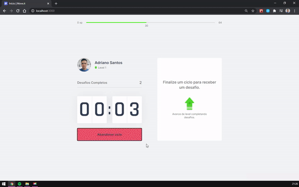

<h1 align="center">
    
</h1>

<h1>
    
</h1>


<p align="center">
  <a href="#-projeto">About</a>&nbsp;&nbsp;&nbsp;|&nbsp;&nbsp;&nbsp;
  <a href="#rocket-tecnologias">Technologies</a>&nbsp;&nbsp;&nbsp;|&nbsp;&nbsp;&nbsp;
  <a href="#rocket-executando">Running</a>&nbsp;&nbsp;&nbsp; | &nbsp;&nbsp;&nbsp;
  <a href="link do site">Demo</a>&nbsp;&nbsp;&nbsp;
  
</p>

---

## 🔖&nbsp; About

loreen

---

## 🚀 Technologies used

The project was developed using the following technologies:

- [ReactJS](https://reactjs.org)
- [Redux](https://redux.org)
- [Axios](https://github.com/axios/axios)

---

## 🗂 Running the project

```bash

    # Clone the repository
    $ git clone https://github.com/danileao/rocketmusic

    # Enter directory
    $ cd rocketmusic

    # Install the dependencies
    $ yarn install

    # Start the project
    $ yarn start
```

---

