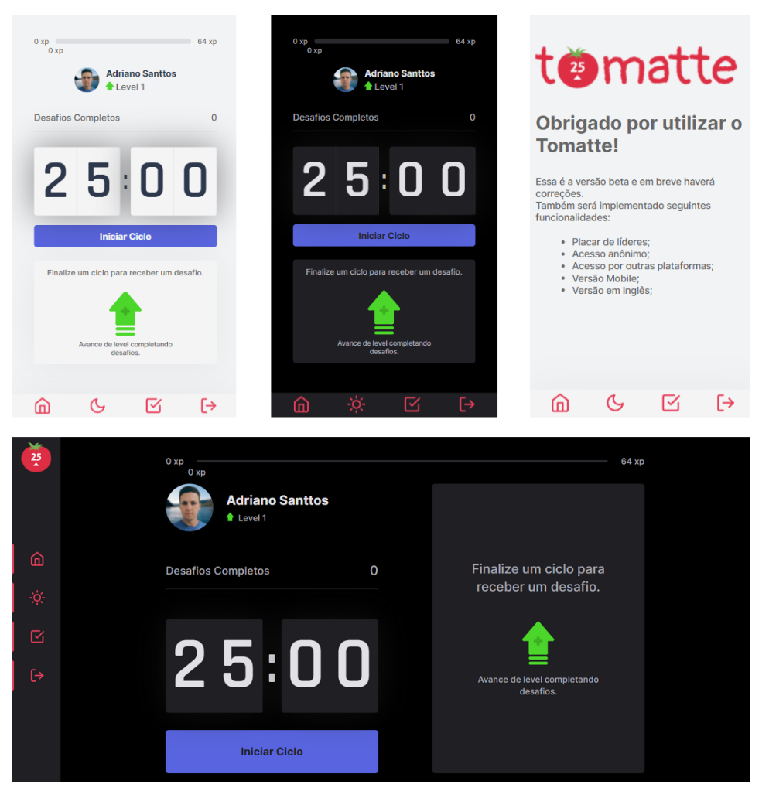

 <div align="center" id="top"> 
  <a> English </a>
  - <a href="README-pt.md"> Portuguese </a>
</div>


<div align="center" id="top"> 
  
 
</div> 

<h1 align="center">Tomatte</h1>

<p align="center">
  

  

  

  

  <!--  -->

  <!--  -->

  <!--  -->
</p>


 <h4 align="center"> 
	🚧  Tomatte 🚀 Under construction...  🚧
</h4> 

<hr> 

<p align="center">
  <a href="#dart-about">About</a> &#xa0; | &#xa0; 
  <a href="#sparkles-features">Features</a> &#xa0; | &#xa0;
  <a href="#rocket-technologies">Technologies</a> &#xa0; | &#xa0;
  <a href="#white_check_mark-requirements">Requirements</a> &#xa0; | &#xa0;
  <a href="#checkered_flag-starting">Starting</a> &#xa0; | &#xa0;
  <!-- <a href="#memo-license">License</a> &#xa0; | &#xa0; -->
  <a href="https://github.com/Adriano-Santtos" target="_blank">Author</a>
</p> &#xa0;

 




&#xa0;
 <p align="center">
  <a 
  href="https://tomatte.vercel.app/" ><strong>👉 Demo Link 👈</strong></a>
  </p>

<br>

## :dart: About ##

**Tomatte** was inspired by [Move.it](https://www.figma.com/file/5d1esZL1c8jwUFlPrcOtjQ/Move.it-1.0-(Copy)?node-id=160%3A2761), a project carried out during the 4th edition of Next Level Week, carried out by [Rocketseat](https://rocketseat.com.br/).

This application combines the [pomodoro technique](https://pt.wikipedia.org/wiki/T%C3%A9cnica_pomodoro#:~:text=A%20T%C3%A9cnica%20Pomodoro%20%C3%A9%20um,minutos%2C%20separados%20por%20breves%20intervalos.) with stretching during breaks, in addition to having a gamification system to make things more fun.

## :sparkles: Features ##

👉 Login with Github; \
👉 Dark mode; \
👉 Responsive website;

**Next Features:**
 * Anonymous access;
 * Leader table;
 * Mobile version

## :rocket: Technologies ##

The following tools were used in this project:

- [Node.js](https://nodejs.org/en/)
- [ReactJS](https://pt-br.reactjs.org/)
- [Next.js](https://nextjs.org/)
- [TypeScript](https://www.typescriptlang.org)
- [NextAuth.js](https://next-auth.js.org/)
- [Vercel](https://vercel.com/)


## :white_check_mark: Requirements ##

Before starting :checkered_flag:, you need to have [Git](https://git-scm.com) and [Node](https://nodejs.org/en/) installed.

## :checkered_flag: Starting ##

```bash
# Clone this project
$ git clone https://github.com/Adriano-Santtos/Tomatte

# Access
$ cd tomatte

# Install dependencies
$ yarn

# Run the project
$ yarn start

# The server will initialize in the <http://localhost:3000>
```

## :memo: License ##

This project is under license from MIT. For more details, see the [LICENSE](LICENSE.md) file.


Made with :heart: by <a href="https://github.com/Adriano-Santtos" target="_blank">Adriano Santos</a>

&#xa0;

<a href="#top">Back to top</a>
